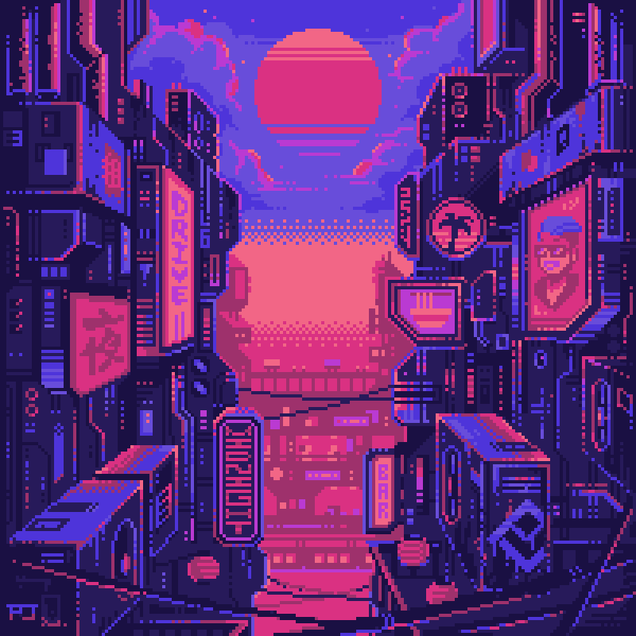

<div align="center">
    
    <br><br>
    <a href="https://github.com/Terminal127/tokyonight-startpage/commits">
        
    </a>
    <a href="https://github.com/Terminal127/tokyonight-startpage/stargazers">
        
    </a>
    <a href="https://github.com/Terminal127/tokyonight-startpage">
        
    </a>
    <a href="https://github.com/Terminal127/tokyonight-startpage/blob/main/LICENSE">
        
    </a>
    <a href="https://github.com/Terminal127/tokyonight-startpage/issues">
        
    </a>
</div>

# Tokyonight Startup Page

A personalized, visually appealing start page for my [DreamDots](https://github.com/Terminal127/Hyprland-dotss)(private) rice. This customizable start page offers quick access to frequently used links, organized by tabs, along with integrated search functionality and a dynamic, animated background. Refer to this wiki to get help to customize this on your own [Tokyonight-Startpage-Wiki](https://github.com/Terminal127/tokyonight-startpage/wiki/TokyoNight-Startup-Wiki)

## Demo (old)
https://github.com/user-attachments/assets/00f3fe0b-5e81-4e99-a0c6-a7060627a725

**Key Features:**

* **Visually Stunning & Organized Tabs:**  Craft a personalized browsing experience with customizable tabs.  Categorize your links, and give each tab a unique personality with custom panel images (including animated GIFs!), color schemes, and icons.  Detailed documentation guides you through customizing every component, empowering even those unfamiliar with JavaScript to create a visually stunning and organized start page.

* **Effortless Web Searching:** Search the web directly from your start page using your preferred search engines.  Prefixes (e.g., `!g` for Google, `!d` for DuckDuckGo) streamline your searches.  An enhanced search bar features custom search quick strings and completion suggestions based on your search history, making finding what you need faster than ever with a history feature that lets you autocomplete your last searched item using the searchtab and persists over sessions.

* **Dynamic & Engaging Backgrounds:** Bring your start page to life with dynamic animated GIF backgrounds or static images for each tab.  Instantly switch the global background wallpaper using the quick configurator (activated by pressing `q`).  Express yourself and set the mood with captivating visuals.

* **Intuitive & Easy Configuration:**  Personalize Tokyonight effortlessly with the `userconfig.js` file.  Modify links, tabs, search engines, and various other settings.  The integrated in-browser configurator, accessible via the `ConfigTab` component (activated with the `q` key), provides real-time feedback as you edit the JSON configuration.  Click "Save" and your changes are applied instantly you can direcly search the element in the search option given in the config changing process which allows you to search an item or cycle through multiple items to help you exactly find the element which you want to change making this process more robust and easy.

* **Streamlined Navigation with Keybindings:** Optimize your workflow with customizable keybindings.  Quickly access core features like the search bar (`s`) and configurator (`q`).  Define your own shortcuts in `userconfig.js` for an even more personalized experience.

* **Persistent Personalization with Local Storage:** Your customized configuration is automatically saved to your browser's local storage, preserving your settings across browsing sessions.  A new feature allows you to clear this local storage directly within the configurator, providing a more convenient alternative to clearing browser cookies (although clearing browser data will also remove the configuration).

## Screenshots 
<!-- The main images section -->
<div align="center">
  <table>
    <tr>
      <td align="center">
        
      </td>
    </tr>
    <tr>
      <td align="center">
        
      </td>
    </tr>
    <tr>
      <td align="center">
        
      </td>
    </tr>
  </table>
</div>

## Installation and Setup

This project is designed for ease of use. Simply download and open in a browser. No server-side setup is required.

1. **Clone or Download:**
   - **Clone the Repository:**
     ```bash
     git clone https://github.com/your-username/Tokyonight-startup-page.git
     ```
   - **Download as ZIP (Simpler for Users):**  Download the project as a ZIP file from the repository and extract it to a local folder.

2. **Open `index.html`:**  Navigate to the project folder and open the `index.html` file in your preferred web browser.  This will load the start page.

3. You can use the google extention  named `custom new Tab url` which allows you to set a local file as the startup page or you can direcly upload the project using github pages in your own repo using your custom configs :)

<details>
  
 <summary>Banners Used</summary>

> [!IMPORTANT]
> The gifs may take some time for preview depending on your network speed, 
> You can see these in the `src/img/banner` subfolder

<div align="center">
  
|  |  |  |
|:---:|:---:|:---:|
| [](src/img/banners/bg-1.gif) | [](src/img/banners/bg-2.gif) | [](src/img/banners/bg-3.gif) |
| [](src/img/banners/bg-4.gif) | [](src/img/banners/bg-5.gif) | [](src/img/banners/bg-6.gif) |
| [](src/img/banners/bg-7.gif) | [](src/img/banners/bg-8.gif) | [](src/img/banners/bg-9.gif) |
| [](src/img/banners/bg-10.gif) | [](src/img/banners/bg-11.gif) | [](src/img/banners/bg-12.gif) |

</div>

</details>

## Credits

Improvised on [Dawn](https://github.com/b-coimbra/dawn), and [Taurus](https://github.com/AllJavi/tartarus-startpage) 

## Contributing

If you'd like to contribute to the Tokyonight Startup Page, feel free to fork the repository and submit pull requests. Bug reports and feature suggestions are also welcome!

We appreciate any contributions that can help improve the project. Here are some ways you can contribute:

1. **Bug Reports:** If you encounter any issues while using the startup page, please open an issue on GitHub with a detailed description of the problem.

2. **Feature Requests:** Have an idea for a new feature? Open an issue to discuss it with the community and maintainers.

3. **Code Contributions:** If you'd like to add a new feature or fix a bug:
   - Fork the repository
   - Create a new branch for your feature or bugfix
   - Make your changes
   - Submit a pull request with a clear description of your changes

4. **Documentation:** Help improve the README or add inline code comments to make the project more accessible to others.

5. **Design:** If you have ideas for improving the user interface or user experience, we'd love to hear them!

Please ensure that your contributions adhere to the project's coding standards and practices. When in doubt, don't hesitate to open an issue to discuss your ideas before making significant changes.

Thank you for considering contributing to the Tokyonight Startup Page!
